# Stack App - Production-Ready Docker Infrastructure Manager

**Version:** 1.1
**Status:** Planning Phase

Deploy one container. Get a complete production infrastructure.

Stack App transforms your Docker host into a production-ready platform with automatic reverse proxy, SSL certificates, and intelligent routing. Deploy complex multi-service applications, route to external APIs, and manage everything through a single REST API—all from one container.

---

## What It Does

Stack App is infrastructure-as-code for Docker, packaged as a single container. It eliminates the complexity of manually configuring reverse proxies, SSL certificates, and container orchestration.

**The Problem It Solves:**
Setting up production Docker infrastructure typically requires manually configuring Traefik/Nginx, managing SSL certificates, writing docker-compose files, and maintaining routing rules. Each new service means updating multiple configuration files and restarting proxies.

**The Stack App Solution:**
Deploy Stack App once. It automatically provisions and manages:

- **Traefik Reverse Proxy** - Auto-deployed, configured, and maintained
- **SSL/TLS Certificates** - Let's Encrypt automation with multi-provider support
- **Container Stacks** - Full lifecycle management via REST API
- **Dynamic Routing** - Path-based and domain-based routing without config files
- **External Integration** - Route to non-Docker services (internal APIs, external SaaS, S3 buckets)
- **State Management** - Persistent SQLite database with automatic recovery

**Real-World Example:**
```
example.com           → Your main website (Docker container)
example.com/api       → Internal API server (https://api.internal:8080)
example.com/auth      → External auth service (https://auth.saas.com)
example.com/media     → S3 bucket (https://bucket.s3.amazonaws.com)
```
All configured through a single JSON API call. SSL certificates automatically provisioned. No config files to edit.

## Key Features

### 🚀 Single Container Deployment
Deploy Stack App, and it automatically creates and manages the Traefik reverse proxy. No manual Traefik setup required.

### 🔄 Complete Stack Management
- Create stacks with multiple services
- Start, stop, restart entire stacks or individual services
- Update service configurations on the fly
- Monitor real-time container status
- Access centralized logs

### 🌐 Intelligent Reverse Proxy
- **Docker Service Routes**: Automatic Traefik label generation for containerized services
- **External Routes**: Route traffic to non-Docker targets (localhost ports, LAN servers, external APIs)
- **System Routes**: Pre-configured access to Stack App API and Traefik dashboard
- **Domain Routing**: Host-based and path-based routing rules
- **SSL/TLS**: Automatic Let's Encrypt certificates with auto-renewal

### 🔐 Security
- API key authentication for all endpoints
- SSL/TLS encryption via Let's Encrypt
- ForwardAuth integration for Traefik dashboard
- Configurable middleware support

### 📊 Built-in Management Interface
- Stack App API: `http://your-server/stack/api/v1/*`
- Traefik Dashboard: `http://your-server/traefik/dashboard/`

---

## Architecture

```mermaid
graph TB
    subgraph Internet
        Client[External Traffic<br/>Ports 80/443]
    end

    subgraph Host["Docker Host"]
        subgraph Traefik["Traefik Container (auto-deployed)"]
            TraefikProxy[Traefik Reverse Proxy]
            Routes["Routes:<br/>• /stack/* → Stack App<br/>• /traefik/* → Dashboard<br/>• Custom service routes<br/>• External routes"]
        end

        subgraph StackApp["Stack App Container (You Deploy This)"]
            API[REST API]
            DB[(SQLite DB)]
            Manager["Manager:<br/>• Traefik<br/>• Stacks<br/>• Routes<br/>• SSL"]
        end

        subgraph ManagedContainers["Managed Containers"]
            Frontend[web-app-frontend<br/>with Traefik labels]
            Backend[web-app-backend<br/>with Traefik labels]
            Database[db-postgres<br/>with Traefik labels]
        end

        subgraph ExternalTargets["External Targets"]
            LocalHost[localhost:8080]
            LAN[192.168.1.50:3000]
            External[api.external.com]
        end
    end

    Client --> TraefikProxy
    TraefikProxy --> API
    TraefikProxy --> Routes
    Routes --> Frontend
    Routes --> Backend
    Routes --> Database
    Routes --> LocalHost
    Routes --> LAN
    Routes --> External

    StackApp --> Traefik
    Manager --> ManagedContainers
    Manager --> Traefik

    style Client fill:#e1f5ff
    style Traefik fill:#fff4e6
    style StackApp fill:#e8f5e9
    style ManagedContainers fill:#f3e5f5
    style ExternalTargets fill:#fce4ec
```



---

## Quick Start

### Prerequisites

- Linux-based operating system
- Docker or Docker-compatible container runtime (Docker Engine, Podman)
- Ports 80 and 443 available on the host
- Domain name(s) pointing to your server (for SSL/TLS)

### Installation

#### Option 1: NPM Global Package (Planned)

```bash
npm install -g @stack-app/docker-stack-api
stack-app --config /path/to/config.yaml
```

#### Option 2: Docker Container

```bash
# Create required directories
mkdir -p stack-app/{config,data}

# Create configuration file
cat > stack-app/config/config.yaml <<EOF
database:
  type: sqlite
  path: /var/lib/stack-app/stacks.db

api:
  port: 3001
  keys:
    - "your-api-key-here"

docker:
  socketPath: /var/run/docker.sock
  network: traefik-proxy

proxy:
  enabled: true
  provider: traefik
  traefikImage: traefik:v3.0
  httpPort: 80
  httpsPort: 443
  ssl:
    enabled: true
    provider: letsencrypt
    email: admin@example.com
    staging: false
    challengeType: http
  systemRoutes:
    stackApi:
      enabled: true
      pathPrefix: /stack
      stripPrefix: true
    traefik:
      enabled: true
      pathPrefix: /traefik
      stripPrefix: true
      requireAuth: true

logging:
  level: info
  path: /var/log/stack-app
EOF

# Run Stack App container
docker run -d \
  --name stack-app \
  --restart unless-stopped \
  -v /var/run/docker.sock:/var/run/docker.sock:ro \
  -v $(pwd)/stack-app/config:/etc/stack-app:ro \
  -v $(pwd)/stack-app/data:/var/lib/stack-app:rw \
  --network traefik-proxy \
  stack-app/docker-stack-api:latest
```

Stack App will automatically:
1. Create the `traefik-proxy` Docker network
2. Deploy and configure the Traefik container
3. Expose itself at `http://your-server/stack/*`
4. Expose Traefik dashboard at `http://your-server/traefik/*`

---

## Using Stack App on Fresh Linux Installation

### Compatible Container Runtimes

Stack App works with any Docker API-compatible container runtime:

- ✅ **Docker Engine** (recommended)
- ✅ **Podman** (Docker API compatibility mode)
- ✅ **Docker CE/EE**
- ✅ **Moby**

### Setup on Ubuntu/Debian

```bash
# Update system
sudo apt update && sudo apt upgrade -y

# Install Docker
curl -fsSL https://get.docker.com -o get-docker.sh
sudo sh get-docker.sh

# Add current user to docker group (optional)
sudo usermod -aG docker $USER
newgrp docker

# Verify Docker installation
docker --version
docker ps

# Create Stack App directory structure
mkdir -p ~/stack-app/{config,data}
cd ~/stack-app

# Create config.yaml (see Quick Start above)

# Deploy Stack App
docker run -d \
  --name stack-app \
  --restart unless-stopped \
  -v /var/run/docker.sock:/var/run/docker.sock:ro \
  -v ~/stack-app/config:/etc/stack-app:ro \
  -v ~/stack-app/data:/var/lib/stack-app:rw \
  --network bridge \
  stack-app/docker-stack-api:latest

# Verify Stack App is running
docker logs stack-app

# Verify Traefik was auto-created
docker ps | grep traefik
```

### Setup with Podman (Docker API Compatibility)

Podman provides Docker API compatibility via a socket:

```bash
# Install Podman (Ubuntu/Debian)
sudo apt update
sudo apt install -y podman

# Or on RHEL/CentOS/Fedora
sudo dnf install -y podman

# Enable Podman socket (Docker API compatibility)
systemctl --user enable --now podman.socket

# Verify Podman socket
systemctl --user status podman.socket

# Get socket path
export DOCKER_HOST=unix:///run/user/$UID/podman/podman.sock

# Create Stack App directory
mkdir -p ~/stack-app/{config,data}
cd ~/stack-app

# Create config.yaml with Podman socket path
cat > config/config.yaml <<EOF
database:
  type: sqlite
  path: /var/lib/stack-app/stacks.db

api:
  port: 3001
  keys:
    - "your-api-key-here"

docker:
  socketPath: /run/user/$(id -u)/podman/podman.sock
  network: traefik-proxy

proxy:
  enabled: true
  provider: traefik
  traefikImage: traefik:v3.0
  httpPort: 80
  httpsPort: 443
  ssl:
    enabled: true
    provider: letsencrypt
    email: admin@example.com
  systemRoutes:
    stackApi:
      enabled: true
      pathPrefix: /stack
    traefik:
      enabled: true
      pathPrefix: /traefik

logging:
  level: info
EOF

# Run with Podman
podman run -d \
  --name stack-app \
  --restart unless-stopped \
  -v /run/user/$(id -u)/podman/podman.sock:/var/run/docker.sock:ro \
  -v ~/stack-app/config:/etc/stack-app:ro \
  -v ~/stack-app/data:/var/lib/stack-app:rw \
  stack-app/docker-stack-api:latest

# Verify
podman ps
```

### Port Availability Check

Before deploying, ensure required ports are available:

```bash
# Check if ports 80 and 443 are free
sudo netstat -tulpn | grep -E ':80|:443'

# Or with ss
sudo ss -tulpn | grep -E ':80|:443'

# If ports are occupied, stop the conflicting service
# Example for nginx:
sudo systemctl stop nginx
sudo systemctl disable nginx
```

### Firewall Configuration

```bash
# UFW (Ubuntu/Debian)
sudo ufw allow 80/tcp
sudo ufw allow 443/tcp
sudo ufw reload

# firewalld (RHEL/CentOS)
sudo firewall-cmd --permanent --add-service=http
sudo firewall-cmd --permanent --add-service=https
sudo firewall-cmd --reload

# iptables
sudo iptables -A INPUT -p tcp --dport 80 -j ACCEPT
sudo iptables -A INPUT -p tcp --dport 443 -j ACCEPT
sudo iptables-save
```

---

## Usage Examples

### Create a Stack with Services

```bash
curl -X POST http://your-server/stack/api/v1/stacks \
  -H "X-API-Key: your-api-key-here" \
  -H "Content-Type: application/json" \
  -d '{
    "id": "web-app",
    "services": [
      {
        "id": "frontend",
        "image": "nginx:latest",
        "containerConfig": {
          "ports": [
            {
              "name": "http",
              "containerPort": 80
            }
          ],
          "proxy": {
            "enabled": true,
            "domains": ["example.com", "www.example.com"],
            "port": 80,
            "ssl": true,
            "redirectToHttps": true
          }
        }
      },
      {
        "id": "backend",
        "image": "node:18-alpine",
        "containerConfig": {
          "ports": [
            {
              "name": "api",
              "containerPort": 3000
            }
          ],
          "environment": {
            "NODE_ENV": "production",
            "PORT": "3000"
          },
          "proxy": {
            "enabled": true,
            "domains": ["api.example.com"],
            "port": 3000,
            "ssl": true
          }
        }
      }
    ]
  }'
```

### Start a Stack

```bash
curl -X POST http://your-server/stack/api/v1/stacks/web-app/start \
  -H "X-API-Key: your-api-key-here"
```

### Get Stack Status

```bash
curl http://your-server/stack/api/v1/stacks/web-app/status \
  -H "X-API-Key: your-api-key-here"
```

### Create External Route (Non-Docker Target)

```bash
# Route traffic to a service running on host port 8080
curl -X POST http://your-server/stack/api/v1/proxy/external-routes \
  -H "X-API-Key: your-api-key-here" \
  -H "Content-Type: application/json" \
  -d '{
    "name": "legacy-app",
    "domains": ["legacy.example.com"],
    "target": "http://localhost:8080",
    "ssl": true,
    "redirectToHttps": true
  }'
```

### List All Proxy Routes

```bash
curl http://your-server/stack/api/v1/proxy/routes \
  -H "X-API-Key: your-api-key-here"
```

### View SSL Certificates

```bash
curl http://your-server/stack/api/v1/proxy/certificates \
  -H "X-API-Key: your-api-key-here"
```

---

## API Endpoints

### Stack Management
- `GET /api/v1/stacks` - List all stacks
- `POST /api/v1/stacks` - Create new stack
- `GET /api/v1/stacks/{stackId}` - Get stack details
- `PUT /api/v1/stacks/{stackId}` - Update stack
- `DELETE /api/v1/stacks/{stackId}` - Delete stack

### Stack Lifecycle
- `POST /api/v1/stacks/{stackId}/start` - Start stack
- `POST /api/v1/stacks/{stackId}/stop` - Stop stack
- `POST /api/v1/stacks/{stackId}/restart` - Restart stack
- `GET /api/v1/stacks/{stackId}/status` - Get status

### Logging
- `GET /api/v1/stacks/{stackId}/logs` - Get stack logs
- `GET /api/v1/stacks/{stackId}/services/{serviceId}/logs` - Get service logs

### External Routes
- `GET /api/v1/proxy/external-routes` - List external routes
- `POST /api/v1/proxy/external-routes` - Create external route
- `GET /api/v1/proxy/external-routes/{routeId}` - Get route details
- `PUT /api/v1/proxy/external-routes/{routeId}` - Update route
- `DELETE /api/v1/proxy/external-routes/{routeId}` - Delete route

### Proxy Management
- `GET /api/v1/proxy/routes` - List all proxy routes
- `GET /api/v1/proxy/certificates` - List SSL certificates
- `POST /api/v1/proxy/certificates/{domain}/renew` - Renew certificate

### Authentication
- `GET /api/v1/auth/verify` - Verify API key (used by Traefik ForwardAuth)

### Health
- `GET /health` - Health check (no authentication required)

---

## Configuration Reference

### Minimal Configuration

```yaml
api:
  port: 3001
  keys:
    - "your-api-key-here"

proxy:
  enabled: true
  ssl:
    email: admin@example.com
```

### Complete Configuration

See [REQUIREMENTS.md](REQUIREMENTS.md) section 7.3 for full configuration schema.

---

## System Routes

Stack App automatically configures two system routes:

### 1. Stack App API Route
- **Default Path:** `http://{any-host}/stack/*`
- **Purpose:** Access Stack App REST API through Traefik
- **Example:** `http://your-server/stack/api/v1/stacks`
- **Authentication:** X-API-Key header required

### 2. Traefik Dashboard Route
- **Default Path:** `http://{any-host}/traefik/*`
- **Purpose:** Access Traefik dashboard and API
- **Example:** `http://your-server/traefik/dashboard/`
- **Authentication:** X-API-Key header required (same as Stack App)

Both routes can be customized or disabled in configuration.

---

## Routing Types

Stack App supports three types of routes:

### 1. Docker Service Routes (Automatic)
When you create a service with `proxy.enabled: true`, Stack App automatically:
- Generates Traefik Docker labels
- Configures domain and path routing
- Provisions SSL certificates via Let's Encrypt
- Sets up health checks

**Example:**
```json
{
  "proxy": {
    "enabled": true,
    "domains": ["app.example.com"],
    "port": 80,
    "ssl": true
  }
}
```

### 2. External Routes (Manual)
Route traffic to non-Docker targets:
- Services running on host ports (`http://localhost:8080`)
- LAN servers (`http://192.168.1.50:3000`)
- External APIs (`https://api.external.com`)

**Example:**
```json
{
  "name": "internal-tool",
  "domains": ["tools.example.com"],
  "target": "http://192.168.1.100:9000",
  "ssl": true
}
```

### 3. System Routes (Pre-configured)
Built-in routes for Stack App and Traefik management interfaces.

---

## SSL/TLS Certificates

Stack App automatically manages SSL certificates via Let's Encrypt:

- ✅ Automatic certificate provisioning
- ✅ Automatic renewal (90-day expiry)
- ✅ HTTP-01 or TLS-ALPN-01 challenge support
- ✅ Wildcard certificates (with DNS challenge - future)
- ✅ Certificate status monitoring
- ✅ Manual renewal endpoint

### Certificate Staging

For testing, use Let's Encrypt staging environment:

```yaml
proxy:
  ssl:
    staging: true  # Use staging certificates
```

---

## Database and Persistence

Stack App uses SQLite for persistent storage:

- **Location:** `/var/lib/stack-app/stacks.db`
- **Stores:**
  - Stack definitions
  - Service configurations
  - Proxy routes
  - External routes
  - SSL certificate metadata

**Backup:**
```bash
# Stop Stack App
docker stop stack-app

# Backup database
cp ~/stack-app/data/stacks.db ~/stack-app-backup-$(date +%Y%m%d).db

# Start Stack App
docker start stack-app
```

---

## Troubleshooting

### Ports 80/443 Already in Use

```bash
# Find what's using the ports
sudo netstat -tulpn | grep -E ':80|:443'

# Stop conflicting service (e.g., nginx, apache)
sudo systemctl stop nginx
sudo systemctl disable nginx
```

### Traefik Container Not Starting

```bash
# Check Stack App logs
docker logs stack-app

# Verify Traefik was created
docker ps -a | grep traefik

# Check Traefik logs
docker logs stack-app-traefik
```

### SSL Certificates Not Provisioning

- Ensure ports 80 and 443 are accessible from the internet
- Verify domain DNS points to your server IP
- Check Let's Encrypt rate limits (use `staging: true` for testing)
- Review Traefik logs: `docker logs stack-app-traefik`

### API Key Authentication Failing

```bash
# Test API key
curl -I http://your-server/stack/health  # Should return 200 (no auth)
curl -I http://your-server/stack/api/v1/stacks \
  -H "X-API-Key: your-key"  # Should return 200 or 401
```

### Podman Socket Issues

```bash
# Ensure socket is running
systemctl --user status podman.socket

# Restart socket
systemctl --user restart podman.socket

# Check socket path
ls -la /run/user/$UID/podman/podman.sock
```

---

## Security Considerations

### API Key Management

- Use strong, randomly generated API keys (minimum 32 characters)
- Rotate keys regularly
- Store keys securely (environment variables, secrets management)
- Never commit keys to version control

**Generate secure key:**
```bash
openssl rand -hex 32
```

### Network Security

- Use firewall rules to restrict access
- Enable SSL/TLS for all production routes
- Consider VPN for Stack App API access
- Use Traefik middleware for rate limiting and security headers

### Container Security

- Run Stack App as non-root user (when available)
- Use read-only Docker socket when possible
- Regularly update base images
- Monitor container logs for suspicious activity

---

## Performance and Scaling

### Resource Requirements

**Minimum:**
- 1 CPU core
- 512 MB RAM
- 1 GB disk space

**Recommended:**
- 2 CPU cores
- 2 GB RAM
- 10 GB disk space (for logs, certificates)

### Scaling Considerations

- Stack App supports 100+ concurrent stacks
- SQLite suitable for single-server deployments
- For multi-server setups, consider database migration (future enhancement)
- Traefik scales horizontally with load balancer

---

## Development Roadmap

- [ ] NPM package distribution
- [ ] OpenAPI specification
- [ ] Web UI for stack management
- [ ] Multi-server support
- [ ] Kubernetes integration
- [ ] PostgreSQL/MySQL database option
- [ ] Metrics and monitoring integration (Prometheus)
- [ ] Webhook notifications
- [ ] Backup and restore functionality
- [ ] Import/export stack definitions

---

## Documentation

### Requirements Specification

Complete technical specifications organized for easy navigation:

- **[Requirements Overview](requirements/index.md)** - Main Software Requirements Specification (SRS)
- **[API Specification](requirements/api-specification.md)** - Complete REST API reference
- **[Data Models](requirements/data-models.md)** - JSON schemas for all objects
- **[Database Schema](requirements/database-schema.md)** - SQLite tables and relationships
- **[Validation Rules](requirements/validation-rules.md)** - Input validation patterns
- **[Examples](requirements/examples/full-stack.md)** - Real-world configuration examples

### Development

- **[CLAUDE.md](CLAUDE.md)** - Development guidelines for Claude Code

---

## License

[License Type - TBD]

---

## Support

For issues, questions, and contributions:

- GitHub Issues: [Repository URL - TBD]
- Documentation: [Docs URL - TBD]

---

**Built with ❤️ for Docker infrastructure management**
